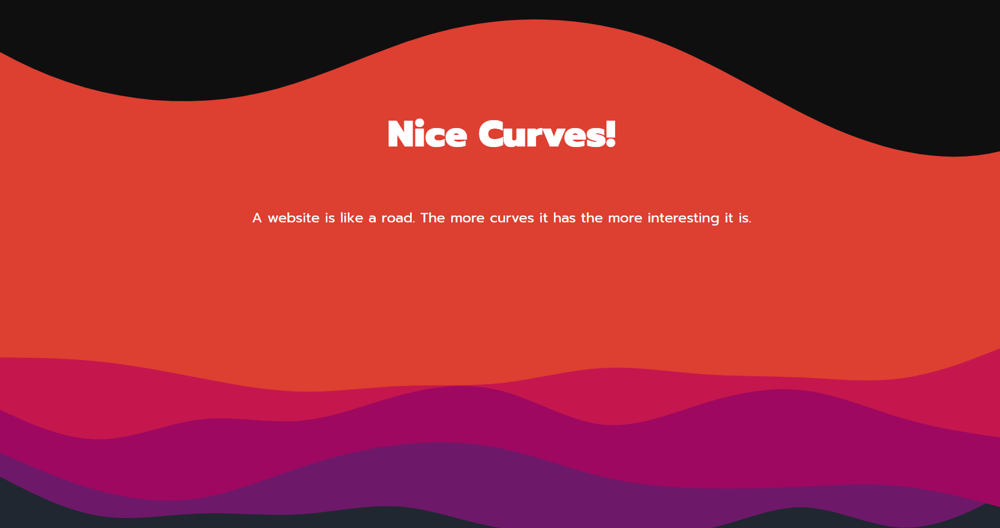
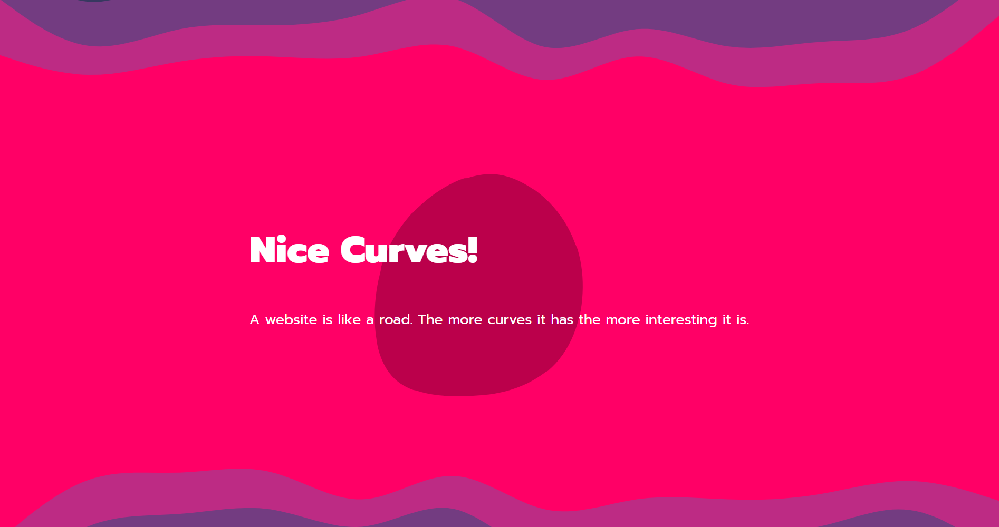

## Playing with animated backgrounds using SVG & CSS

One of the easiest ways to add waves to an element is the ShapeDriver tool. It allows you to create a wave effect generating an SVG path and required CSS code to style it. -[ShapeDriver](https://www.shapedivider.app/)

To add more complex layered waves, you can use the Haikei app to randomly generate a variety of beautiful waves, blobs, and other shapes. You can use any of these shapes as the background image of an element with CSS. Make sure the aspect ratio of the image matches the SVG exported from the app. 
-[Haikei app](https://app.haikei.app/)

KUTE.js is a JavaScript library that makes it easy to animate SVG elements, or morph one shape into another. 
-[KUTE.js](http://thednp.github.io/kute.js/)